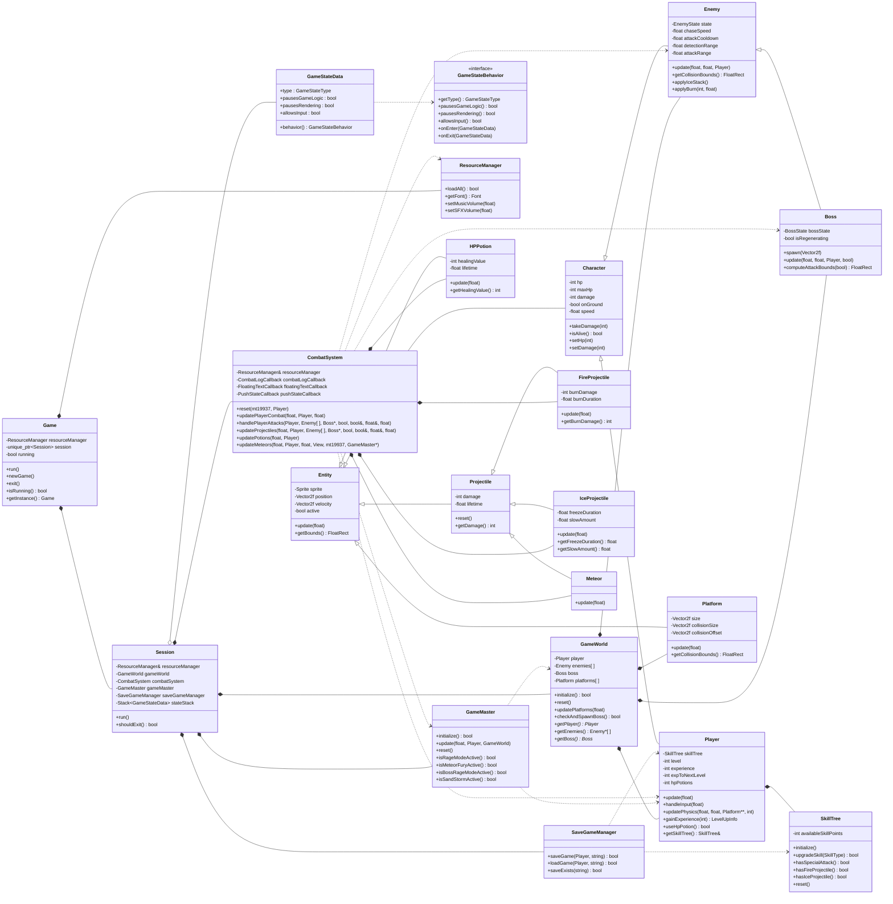

# Platformer Core UML

Gameplay relationships only (UI/drawing, animations, textures, input/key binding, physics, camera, and debug rendering excluded).

```mermaid
classDiagram
direction LR

class Game {
    -ResourceManager resourceManager
    -unique_ptr~Session~ session
    -bool running
    +run()
    +newGame()
    +exit()
    +isRunning() bool
    +getInstance() Game
}

class Session {
    -ResourceManager& resourceManager
    -GameWorld gameWorld
    -CombatSystem combatSystem
    -GameMaster gameMaster
    -SaveGameManager saveGameManager
    -Stack~GameStateData~ stateStack
    +run()
    +shouldExit() bool
}

class GameWorld {
    -Player player
    -Enemy enemies[ ]
    -Boss boss
    -Platform platforms[ ]
    +initialize() bool
    +reset()
    +updatePlatforms(float)
    +checkAndSpawnBoss() bool
    +getPlayer() Player*
    +getEnemies() Enemy*[ ]
    +getBoss() Boss*
}

class GameMaster {
    +initialize() bool
    +update(float, Player, GameWorld)
    +reset()
    +isRageModeActive() bool
    +isMeteorFuryActive() bool
    +isBossRageModeActive() bool
    +isSandStormActive() bool
}

class GameStateData {
    +type : GameStateType
    +pausesGameLogic : bool
    +pausesRendering : bool
    +allowsInput : bool
    +behavior() GameStateBehavior
}

class GameStateBehavior {
    <<interface>>
    +getType() GameStateType
    +pausesGameLogic() bool
    +pausesRendering() bool
    +allowsInput() bool
    +onEnter(GameStateData)
    +onExit(GameStateData)
}

class CombatSystem {
    -ResourceManager& resourceManager
    -CombatLogCallback combatLogCallback
    -FloatingTextCallback floatingTextCallback
    -PushStateCallback pushStateCallback
    +reset(mt19937, Player)
    +updatePlayerCombat(float, Player, float)
    +handlePlayerAttacks(Player, Enemy[ ], Boss*, bool, bool&, float&, float)
    +updateProjectiles(float, Player, Enemy[ ], Boss*, bool, bool&, float&, float)
    +updatePotions(float, Player)
    +updateMeteors(float, Player, float, View, mt19937, GameMaster*)
}

class ResourceManager {
    +loadAll() bool
    +getFont() Font
    +setMusicVolume(float)
    +setSFXVolume(float)
}

class SaveGameManager {
    +saveGame(Player, string) bool
    +loadGame(Player, string) bool
    +saveExists(string) bool
}

class Entity {
    -Sprite sprite
    -Vector2f position
    -Vector2f velocity
    -bool active
    +update(float)
    +getBounds() FloatRect
}

class Character {
    -int hp
    -int maxHp
    -int damage
    -bool onGround
    -float speed
    +takeDamage(int)
    +isAlive() bool
    +setHp(int)
    +setDamage(int)
}

class Player {
    -SkillTree skillTree
    -int level
    -int experience
    -int expToNextLevel
    -int hpPotions
    +update(float)
    +handleInput(float)
    +updatePhysics(float, float, Platform**, int)
    +gainExperience(int) LevelUpInfo
    +useHpPotion() bool
    +getSkillTree() SkillTree&
}

class SkillTree {
    -int availableSkillPoints
    +initialize()
    +upgradeSkill(SkillType) bool
    +hasSpecialAttack() bool
    +hasFireProjectile() bool
    +hasIceProjectile() bool
    +reset()
}

class Enemy {
    -EnemyState state
    -float chaseSpeed
    -float attackCooldown
    -float detectionRange
    -float attackRange
    +update(float, float, Player)
    +getCollisionBounds() FloatRect
    +applyIceStack()
    +applyBurn(int, float)
}

class Boss {
    -BossState bossState
    -bool isRegenerating
    +spawn(Vector2f)
    +update(float, float, Player, bool)
    +computeAttackBounds(bool) FloatRect
}

class Platform {
    -Vector2f size
    -Vector2f collisionSize
    -Vector2f collisionOffset
    +update(float)
    +getCollisionBounds() FloatRect
}

class Projectile {
    -int damage
    -float lifetime
    +reset()
    +getDamage() int
}

class FireProjectile {
    -int burnDamage
    -float burnDuration
    +update(float)
    +getBurnDamage() int
}

class IceProjectile {
    -float freezeDuration
    -float slowAmount
    +update(float)
    +getFreezeDuration() float
    +getSlowAmount() float
}

class Meteor {
    +update(float)
}

class HPPotion {
    -int healingValue
    -float lifetime
    +update(float)
    +getHealingValue() int
}

Game *-- Session
Game *-- ResourceManager
Session *-- GameWorld
Session *-- CombatSystem
Session *-- GameMaster
Session *-- SaveGameManager
Session o-- GameStateData
GameStateData ..> GameStateBehavior
GameWorld *-- Player
GameWorld *-- Enemy
GameWorld *-- Boss
GameWorld *-- Platform
GameMaster ..> Player
GameMaster ..> GameWorld
CombatSystem ..> Player
CombatSystem ..> Enemy
CombatSystem ..> Boss
CombatSystem ..> GameMaster
CombatSystem ..> ResourceManager
CombatSystem *-- FireProjectile
CombatSystem *-- IceProjectile
CombatSystem *-- Meteor
CombatSystem *-- HPPotion
SaveGameManager ..> Player
SaveGameManager ..> SkillTree
Player *-- SkillTree
Character <|-- Player
Character <|-- Enemy
Enemy <|-- Boss
Entity <|-- Character
Entity <|-- Platform
Entity <|-- Projectile
Entity <|-- HPPotion
Projectile <|-- FireProjectile
Projectile <|-- IceProjectile
Projectile <|-- Meteor
```
