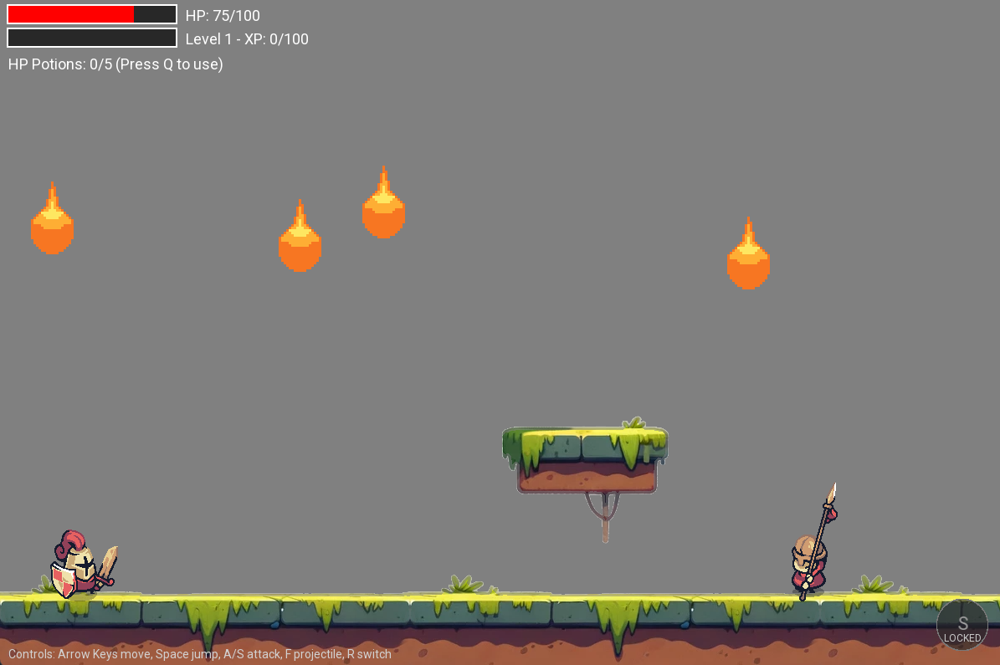
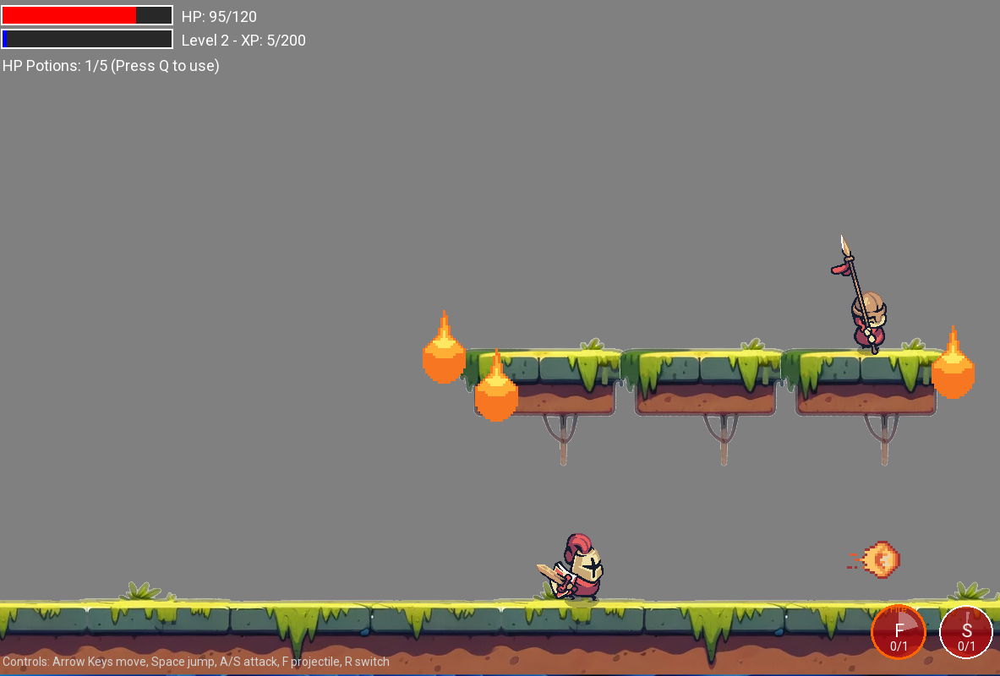
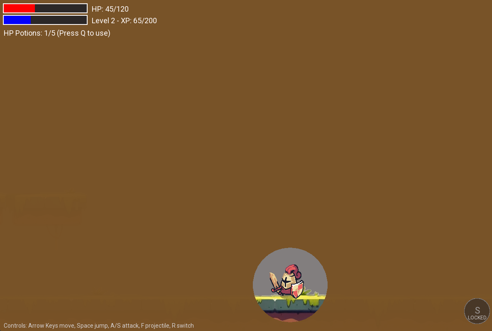
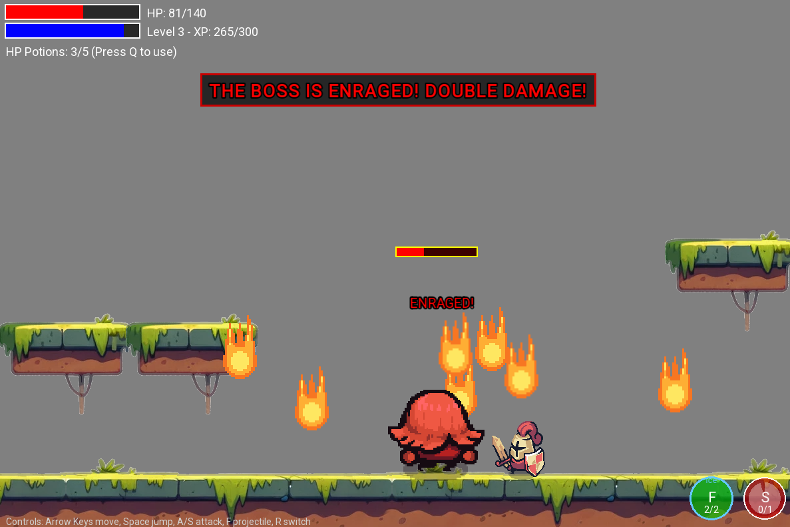

# ⚔️ Platformer Warrior

A 2D side-scrolling action platformer built in C++ with SFML, created as a Data Structures programming project at Swinburne University.

## ✨ Technologies

- C++ and object-oriented programming
- SFML 2.5.1 for graphics, audio, input, and the game window
- Custom data structures implemented as header-only templates
- Windows batch and PowerShell build scripts
- GCC 7.3.0 with MinGW-w64
- File-based save data and key binding persistence

## 🚀 Features

- Play through a side-scrolling action level as a warrior
- Fight enemy waves that scale based on player performance
- Face a boss with a second-phase rage state at 50% HP
- Use melee attacks, fire projectiles, ice projectiles, and a chargeable dash attack
- Apply burn stacks with fire and freeze buildup with ice
- Collect HP potions and trigger rage mode when health is low
- Unlock and upgrade abilities through an in-game skill tree
- Save player level, stats, experience, and unlocked skills across two save slots
- Rebind controls from the in-game menu and persist them to `keybindings.cfg`
- Manage game states such as menu, gameplay, and pause screens
- Spawn meteor hazards that ramp up as the fight continues
- Show slow-motion feedback after defeating the boss

## 📍 The Process

I built Platformer Warrior to connect data structures with real gameplay systems instead of leaving them as isolated classroom examples.

The project uses custom implementations of common structures across the game. The skill tree is powered by an N-ary tree, key bindings are stored in a hash table, active entities use a doubly linked list, combat events use a singly linked list, game states use a stack, and pending combat effects use a queue.

I kept the project as a native Windows C++ game with SFML bundled in the repository, so it can be built without installing SFML separately. The gameplay loop combines movement, combat, enemy scaling, persistence, UI screens, and progression into one playable project.

## 🗄️ Data Structures

The project implements and uses these custom data structures:

- `HashTable<K, V>` for key binding storage
- `NTree<T, N>` for the skill tree
- `DoublyLinkedList<T>` for active entity management
- `SinglyLinkedList<T>` for the combat event log
- `Stack<T>` for the game state stack
- `Queue<T>` for pending damage and effect processing

The project also demonstrates these design patterns:

- `Singleton` for the main `Game` instance
- `Iterator` for traversing the custom doubly linked list

## 🚦 Running the Project

1. Clone the repository.
2. Install GCC 7.3.0 with MinGW-w64.
3. Add `mingw64\bin` to your system `PATH`.
4. Verify the compiler:

   ```bash
   g++ --version
   ```

5. Build and run the game:

   ```bat
   build_and_run.bat
   ```

To build without launching the game:

```bat
build_and_run.bat --no-run
```

PowerShell alternative:

```powershell
.\build.ps1
```

The compiled executable is created at:

```text
bin/main.exe
```

## 🎮 Controls

Default controls are rebindable from the in-game menu:

- `A` - Move left
- `D` - Move right
- `Space` - Jump
- `J` - Melee attack
- `K` - Shoot projectile
- `L` - Switch projectile type
- `I` - Special attack
- `H` - Use HP potion
- `T` - Open skill tree

## 🔐 Save Files

Save data is stored as plain text in:

```text
bin/saves/
```

The game supports two save slots. Each save stores player level, HP, damage, experience, and skill tree progress.

## 🎞️ Preview

<p align="center">
    
    
    <br/>
    
    
</p>
